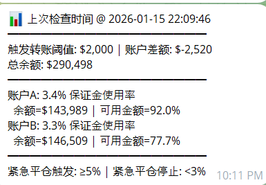

# GRVT 双账户自动平衡与紧急减仓机器人

Language: 中文 

这个项目会**同时监控两个 GRVT 交易子账户（A/B）**，并自动完成：
- **资金再平衡（Transfer/Rebalance）**：当 A/B 两个账户的余额差额超过阈值时，自动划转余额，让两边更接近
划转路径:  账户A 交易账户(trading账户) --> 账户A 资金账户(funding账户) --> 账户B 资金账户--> 账户B交易账户

- **紧急减仓（Unwind，可选）**：当保证金使用率过高时，按配置自动下市价单,分批做双边减仓
- **Telegram 告警 + 状态查询**：支持告警推送，以及可以查询运行状态

本脚本分为生产模式, 和 测试模式. (grvt有一个测试站, 里面是单独的账户系统,用于测试.)
你可以先开小仓位, 直接接入生产模式.
或者先接入测试模式, 再接入生产模式.

GRVT 站点：
- 生产（Prod）：`https://grvt.io`
- 测试站: `https://testnet.grvt.io/`
---

## 重要安全提示（务必先看）
- 本项目**可能会真实下单**并**真实划转资金**。运行前务必确认你清楚它会做什么，以及每个阈值的含义。
- 跑在生产环境的时候, 建议先用迷你仓位, 测试资金划转和紧急关仓功能
- 在你完全确认逻辑之前，建议保持配置`unwind.dryRun: true`（只告警/记录，不真正减仓）。
---

## Windows 
### 如果在你在个人电脑跑, 务必保证网络稳定. (grvt api调用不用翻墙, tg通知需要)
核心步骤

1. 先在Telegram里找到 @BotFather 这个账号, 创建你自己的Telegram机器人, 拿到token.
2. TG 上搜索 @userinfobot 这个机器人, 拿到你的chatId,发消息即可看到,回复里的那串数字就是。 
3. 在两个Grvt账号里, 给FundingAccount 和 TradingAccount创建Api,  funding account的权限勾选(Internal Transfer; External Transfer), tradingAccount的勾选"Transfer; Trade"
记录好分别对应的key,secret, id.  两个账号还需要绑定Google Authenticator验证器, 需要下载一个然后扫码绑定账号.
4. grvt "Address Book"里,把你的两个账号互相添加进白名单
5. 从GitHub Releases ,选择最新版本,下载 `grvt-transfer-windows.zip` 并解压. 运行：双击 `grvt-transfer.exe`
6. 然后在页面里选择测试或者正式环境, 然后填入以上信息, 点击"验证", 验证通过后点击"开始"

- 配置保存位置：`%APPDATA%\\grvt-transfer\\settings.json`（包含api key/secret，请自行注意电脑安全）



- 图片里的3.4% 保证金使用率, 指的是多少的余额,被用来当作保证金, 当超过100%就会爆仓.
- 余额=$143,989, 余额指的是账户余额
- 可用金额, 是指账户 可以实际转出的金额 / 账户余额, 余额不足的情况，一般出现在一个账户大量未实现盈利的时候。这时候你需要手动关一些仓位，释放盈利。
- 紧急减仓,  指保证金使用率大于多少的时候,触发紧急(自动)减仓

---

## Linux VPS docker部署
前置：VPS 已安装 Docker Engine + Docker Compose 插件。

```bash
git clone <你的仓库地址>
cd grvt-transfer
cp .env.example .env
# 编辑 .env 和 config/<env>/*.yaml
docker compose up -d
```

常用命令：
- 查看日志：`docker compose logs -f`
- 停止服务：`docker compose down`
- 更新版本：`git pull && docker compose up -d --build`

---

## 配置说明（避免歧义）
- 运行环境由 `GRVT_ENV=test|prod` 决定（来自 `.env` 或 shell）
- 配置文件**只会读取** `config/<env>/...`（仓库根目录不存在 `config.yaml`）
- 告警阈值配置在：`config/<env>/config.yaml`
- 账户配置相关在：`config/<env>/account_1_config.yaml`、`config/<env>/account_2_config.yaml` 和 `.env`

---

## 核心逻辑（项目到底怎么做决策）
### 1) 再平衡（Transfer/Rebalance）
每轮循环(默认15秒一次)会读取两个账户的信息, ：
- `total_equity`（余额/权益，按 GRVT API 返回字段使用）
- `maintenance_margin`（维持保证金）
- `available_balance`（可用余额）

再平衡规则（核心思路：把 A/B 拉回“接近一半一半”）：
1) 计算差额：`delta = eqA - eqB`
2) 若 `|delta| <= triggerValue`：不触发划转
3) 否则目标划转值：`needed = |delta| / 2`（把差额对半补齐）
4) 从余额更高的一侧划转到另一侧，并做安全上限：
   - `max_by_avail = available_balance`（可用余额不够就不能转）
   - `max_by_mm = equity - 2 * maintenance_margin`（预留保证金缓冲，避免越转越危险）
   - 最终：`transfer = min(needed, max_by_avail, max_by_mm)`

### 2) Funding 归集（Sweep）
再平衡前会先检查 Funding 账户，如果 Funding 的 USDT 大于 `fundingSweepThreshold`，会自动把资金归集到 Trading 子账户，避免“钱在 Funding 里导致 Trading 可用不足”。

### 3) 可用余额不足告警（Available Balance Alert）
当 `(available_balance / total_equity * 100) < minAvailableBalanceAlertPercentage` 时发送 Telegram 告警。

说明：可用余额不足的情况，一般出现在一个账户大量未实现盈利的时候。这时候你需要手动关一些仓位，释放盈利。

### 4) 紧急减仓（Unwind，可选）
保证金使用率定义：
- 保证金使用率达到100%就会爆仓. 所以需要一个自动减仓功能,防止爆仓. 默认设置是任一账户达到,60%开始自动减仓, 两个账户都达到 40% 就停止减仓. 

减仓方式（安全优先、尽量保持对冲结构）：
- 只处理“**两边都有仓位**”的币种。若某个标的只在一边有仓位，会被记录并告警。
- 对每个匹配标的，会按两边**较小的仓位**作为基准做同步减仓：`base_size = min(|sizeA|, |sizeB|)`
- 每一轮只按比例减一部分仓位 (防止市价单一次下去,滑点太高了),减仓幅度会动态计算,大概是30秒左右会减仓完毕. 
---

## 目录结构（快速定位）
- `rebalance_trading_equity.py`：主循环入口 + 日志 + 启动 Telegram bot
- `rebalance/services.py`：账户摘要、再平衡决策、阈值检查
- `flow.py`：转账流程（Trading → Funding → Funding → Trading）
- `unwind/services.py`：紧急减仓逻辑（reduce-only 市价单）
- `alerts/services.py`：Telegram 告警封装

---

## License
MIT（见 `LICENSE`）
